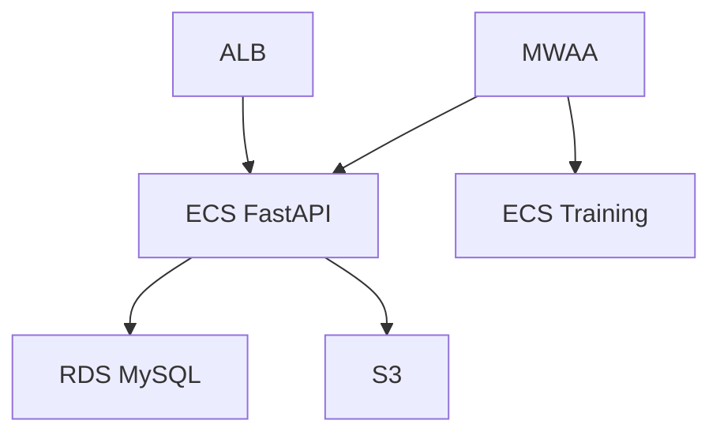

# 📊 Diagramas de Arquitectura

## Lista de Diagramas

Este directorio contiene diagramas visuales de la arquitectura AWS. Los diagramas ayudan a entender la estructura y flujos del sistema.

### Diagramas Requeridos

| Diagrama | Descripción | Estado |
|----------|-------------|--------|
| `architecture-overview.png` | Vista general de la arquitectura AWS | ⏳ Pendiente |
| `data-flow.png` | Flujo de datos ETL y Training | ⏳ Pendiente |
| `networking.png` | VPC, subnets, routing, security groups | ⏳ Pendiente |
| `ci-cd-pipeline.png` | Flujo de CI/CD con GitHub Actions | ⏳ Pendiente |
| `security-architecture.png` | IAM roles, policies, encryption | ⏳ Pendiente |

---

## Herramientas Recomendadas

### 1. **draw.io (diagrams.net)**
- **URL**: https://app.diagrams.net/
- **Ventajas**: Gratis, online, templates AWS
- **Uso**: Crear diagramas y exportar como PNG/SVG

### 2. **Lucidchart**
- **URL**: https://www.lucidchart.com/
- **Ventajas**: Templates AWS oficiales, colaboración
- **Uso**: Diagramas profesionales

### 3. **Mermaid (Markdown)**
- **Ventajas**: Integrado en Markdown, versionado
- **Ejemplo**:


### 4. **AWS Architecture Icons**
- **URL**: https://aws.amazon.com/architecture/icons/
- **Uso**: Iconos oficiales de AWS para diagramas

---

## Plantillas de Diagramas

### Architecture Overview

```
Componentes a incluir:
- ALB
- ECS Services (FastAPI, MLflow)
- MWAA
- RDS MySQL
- S3 Buckets
- Secrets Manager
- CloudWatch
- VPC, Subnets, NAT Gateway
```

### Data Flow

```
Flujos a mostrar:
1. ETL Pipeline (S3 → FastAPI → MySQL → Google Drive)
2. Training Pipeline (Drive → Training → S3)
3. Drift Detection (MySQL → Detection → Training)
```

### Networking

```
Elementos a incluir:
- VPC CIDR
- Public/Private Subnets
- Internet Gateway
- NAT Gateway
- Security Groups
- VPC Endpoints
- Route Tables
```

---

## Cómo Contribuir

1. Crear diagrama con herramienta preferida
2. Exportar como PNG (alta resolución)
3. Guardar en este directorio
4. Actualizar esta README con referencia
5. Commit y push

---

**Nota**: Los diagramas deben actualizarse cuando cambie la arquitectura.

